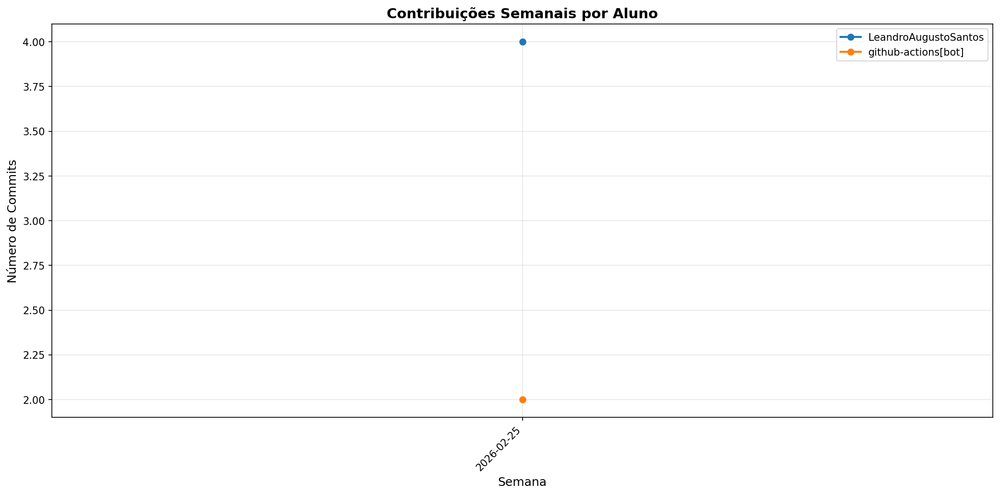

# 📊 Relatório de Contribuições do Projeto

**Última atualização:** 04/03/2026 21:55

---

## 📈 Resumo Geral de Contribuições

| Aluno                |   Commits |   Linhas+ |   Linhas- |   Arquivos |   Docs Commits |   Docs Arquivos |
|----------------------|-----------|-----------|-----------|------------|----------------|-----------------|
| LeandroAugustoSantos |         4 |      2171 |         4 |         45 |              4 |              13 |
| github-actions[bot]  |         2 |        20 |        34 |          3 |              2 |               1 |

## 📅 Contribuições Semanais (Todo o Semestre)

**2026-02-25**: LeandroAugustoSantos: 4, github-actions[bot]: 2

## 📊 Visualização Gráfica

## ℹ️ Observações

- **Commits**: Número total de commits realizados

- **Linhas+**: Linhas de código adicionadas

- **Linhas-**: Linhas de código removidas

- **Arquivos**: Número de arquivos únicos modificados

- **Docs Commits**: Commits em arquivos de documentação

- **Docs Arquivos**: Arquivos de documentação modificados

---

*Relatório gerado automaticamente via GitHub Actions*
